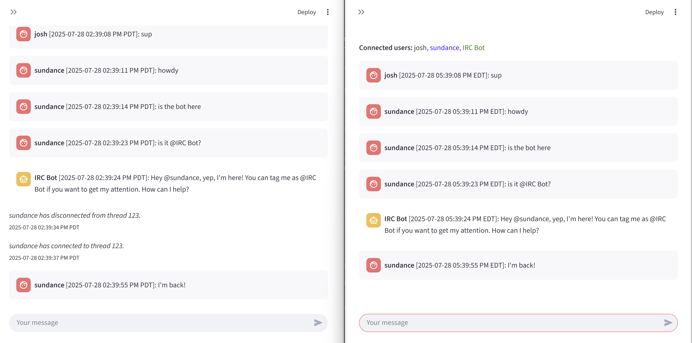

# lg_st_ws

A **multi-user, real-time chat application** powered by FastAPI, Streamlit, WebSockets, and LangGraph, featuring an AI assistant (LLM) in every chat room.

---

## Features

- **Multi-user chat rooms** (threads in LangGraph checkpoints) with real-time updates via WebSockets.
- **Bi-directional websockets** for low-latency communication.
  - **Broadcasting** to all users in a thread.
- **AI assistant** in every thread (OpenAI GPT-4.1 by default).
  - **Passive participation**, speaking only when spoken to.
- **Frontend**: Modern, interactive UI built with Streamlit.
  - **Multithreading** for real-time, bi-directional WebSocket communication.
- **Backend**: FastAPI server orchestrating WebSockets, chat history, and LLM interactions.
- **Time zone support** for user-friendly timestamps.
- **User presence** and system event notifications.

---

## Quick Start

- `OPENAI_API_KEY` in `.env`
- Other environment variables in `docker-compose.yml`
- `docker compose up`
- `http://localhost:8001`

---

## But why though?

This project serves as a practical example of integrating modern web technologies to create a real-time, interactive chat application. It showcases:
- The power of **WebSockets** for real-time communication.
- The flexibility of **FastAPI** for building asynchronous web applications.
- The ease of use of **Streamlit** for creating interactive web UIs.
  - The novel use of multithreading in Streamlit solves many common issues with real-time updates in web applications.
- The capabilities of **LangGraph** for orchestrating complex, persistent workflows with LLMs.

And, more importantly, because it's
* fun
* reminiscent of IRC, a classic protocol for real-time chat
* a better way to make better Streamlit apps with persistent, bi-directional websockets 😉
